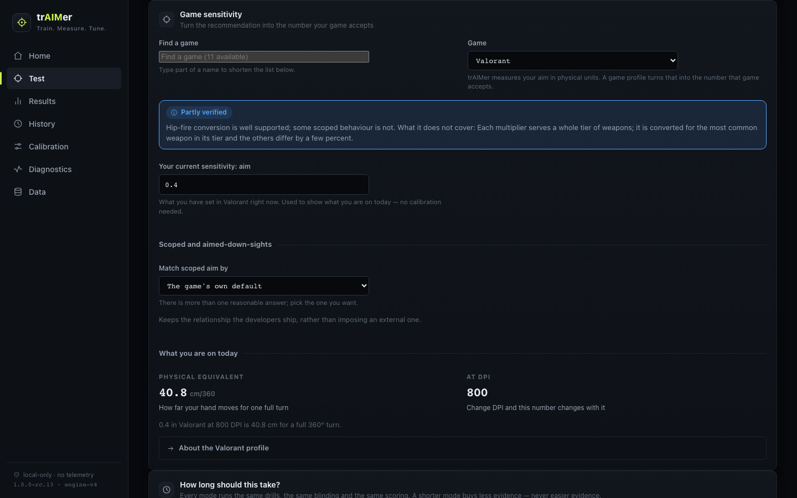
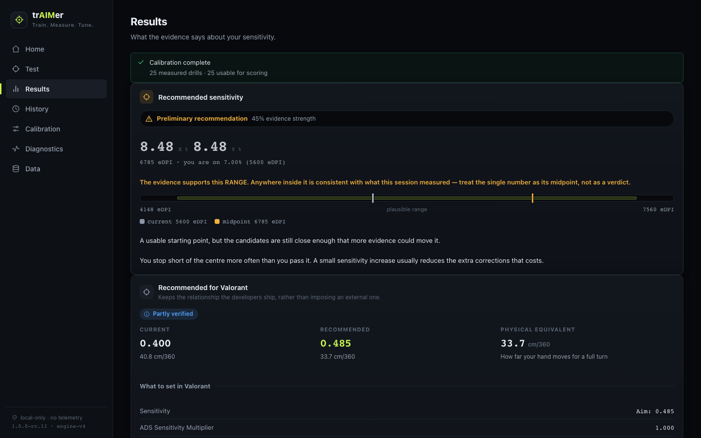
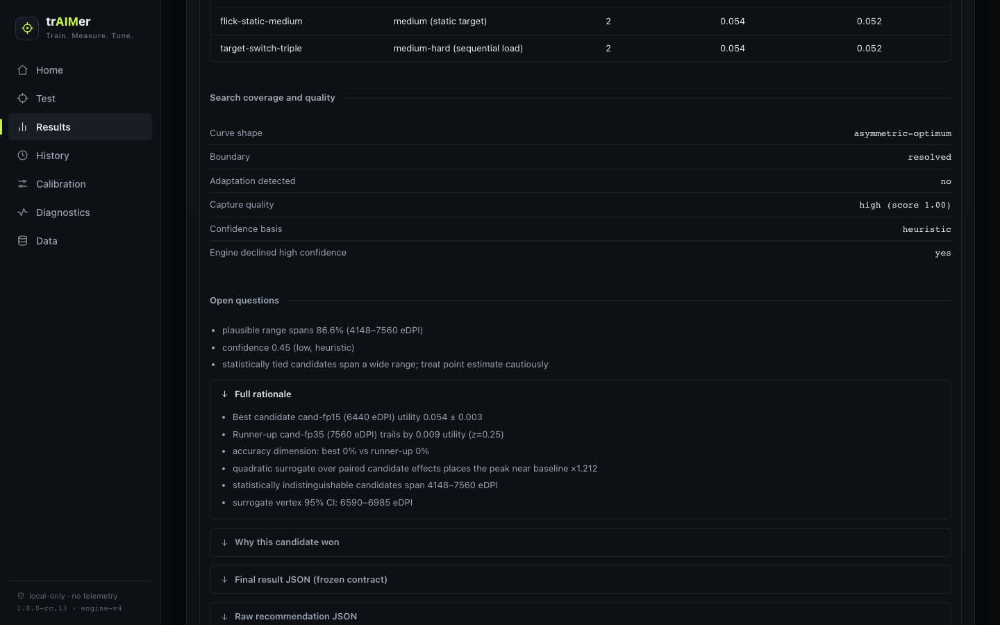

# trAIMer

**Train. Measure. Tune.**

[](https://github.com/happySNAG/trAIMer/actions/workflows/ci.yml)
[](https://github.com/happySNAG/trAIMer/releases/latest)
[](LICENSE)

trAIMer is a sensitivity calibration and aim-training tool for mouse-and-
keyboard FPS players on Windows. It runs a short, blinded aim test across
several candidate sensitivities, measures how you actually perform on each,
estimates the physical sensitivity the evidence supports, and translates that
into the settings of the game you play. It does not touch the game: you type
the number in yourself.

> **Status: 1.0.0**, the first public release. The installer, the calibration
> engine, the results and the twelve game profiles are complete and gated in
> CI, and a person has completed a calibration on the installed build on real
> Windows hardware. Download it from the
> [releases page](https://github.com/happySNAG/trAIMer/releases/latest); what
> was checked before this version was cut is in
> [docs/RELEASE.md](docs/RELEASE.md).



## The problem it solves

"What sensitivity should I use?" is usually answered by copying a pro, by a
converter that assumes you already know your answer in another game, or by
feel. trAIMer treats it as a measurement:

1. You enter your mouse DPI, pick your game, and type the sensitivity you play
   at today.
2. It runs shooting and tracking drills on five candidate sensitivities
   around your current one. The candidates are **blinded**: you see letters,
   not numbers, so you cannot favour one.
3. It scores each candidate on accuracy, speed, tracking precision, correction
   efficiency, overshoot and undershoot control, and consistency, and fits a
   response curve through the evidence.
4. It reports the physical sensitivity that curve supports, **as a range with
   a stated confidence**, and refuses to name a single number when the
   evidence does not justify one.
5. A versioned **game profile** converts that physical sensitivity into the
   value the game's settings screen accepts, with every rounding and every
   unsupported setting stated.

Physical sensitivity is measured in centimetres of mouse travel per full 360°
turn. You never have to think in those units: the results screen shows your
game's numbers, and the physical value is there underneath for anyone who
wants it.

## How it differs from an aim trainer

An aim trainer gives you drills and a score. trAIMer uses drills as an
instrument: the point of a session is not the score but the *comparison*
between blinded sensitivities, run under a fixed protocol with warm-ups,
paired ordering, enforced breaks, validity checks on every trial, and an
optimizer that says how sure it is. It is a measurement tool that happens to
contain an aim trainer, not the other way round.

It does not claim to find the objectively best sensitivity for everyone, or
to prove anything. It estimates what your own evidence supports, in one
sitting, and tells you how much to trust that estimate.

## Supported games

| Game | Profile status |
| --- | --- |
| Counter-Strike 2 | Verified |
| Generic / Raw (any game, in physical units) | Verified |
| Fortnite | Partially verified |
| Valorant | Partially verified |
| Apex Legends | Partially verified (hip-fire only) |
| Call of Duty / Warzone | Partially verified |
| Overwatch 2 | Partially verified |
| Rainbow Six Siege | Partially verified |
| Marvel Rivals | Partially verified |
| The Finals | Partially verified |
| PUBG: Battlegrounds | **Experimental** |
| Battlefield 6 | **Experimental** |

*Partially verified* means hip-fire is well supported and some scoped or
aimed-down-sights behaviour is not, and the profile says which. *Experimental*
means the base constant rests on evidence that does not settle it; the app
labels these in the picker, above their inputs and on every converted value.
The full per-game table of what is and is not converted, with the last
verification date and the important limitation for each, is
[docs/SUPPORT-MATRIX.md](docs/SUPPORT-MATRIX.md). Where the numbers come from,
and why some settings are deliberately refused, is
[docs/GAME-PROFILES.md](docs/GAME-PROFILES.md).

## Installation

Windows 10 or 11, 64-bit. One installer, no admin rights, no terminal.

1. Download `trAIMer-Setup-1.0.0.exe` and its SHA-256 checksum from the
   [release page](https://github.com/happySNAG/trAIMer/releases/latest).
2. Windows SmartScreen will say the publisher is unknown, because the build
   is not code-signed. Click **More info → Run anyway**. You can verify the
   file against its checksum first.
3. Run the installer. It installs for the current user only and puts a
   **trAIMer** icon on the Desktop and in the Start Menu.

Full instructions, including the checksum check and what to do if the capture
helper does not start: [docs/INSTALL-WINDOWS.md](docs/INSTALL-WINDOWS.md).
Why it is unsigned: [docs/CODE-SIGNING.md](docs/CODE-SIGNING.md).

## First run

1. Open **Test**.
2. Enter your player name and your mouse DPI.
3. Pick your game and type the sensitivity you have set in it right now. The
   app shows what that is physically, before any test.
4. Choose how long to test: **Quick**, **Standard** or **Precision**.
5. Press **Start Aim Test** and click the arena to lock your mouse in.
6. Follow the on-screen instruction for each drill: click the targets in a
   shooting drill, follow the target without clicking in a tracking drill.
   Breaks come between candidates and can be skipped.
7. Read the result, then open your game's settings and enter the values
   under "Recommended for *your game*".

Optional but worth doing once: **Diagnostics → Native capture check**
measures what your mouse actually delivers. Without it, sessions are still
valid but capped at a lower confidence.

## Calibration modes

| Mode | Drills | Time | What it can support |
| --- | --- | --- | --- |
| Quick | 30 | about 3 min | Which direction your sensitivity should move, and roughly how far |
| Standard | 50 | about 4 min | A recommendation with a real plausible range, if your curve has a clear shape |
| Precision | 100 | about 8 min | The full protocol: a second refinement round and the narrowest range the engine can produce in one sitting |

Every mode runs the same drills, blinding and scoring. A shorter mode buys
less evidence, never easier evidence, and the results screen never shows a
stronger label than the evidence earns. See
[docs/SESSION-MODES.md](docs/SESSION-MODES.md).

## Results

The results screen answers, in order: what should I change, how confident is
this, what am I doing well or poorly, and what do I do next.



- **Recommended sensitivity**: the value, the plausible range, and a
  confidence label. When the evidence is thin it says **More data needed**
  and offers to continue the same calibration rather than inventing a number.
- **Recommended for *your game***: what to set, what you are on today, the
  physical equivalent, and every rounding the game's own grid forced.
- **How you performed**: accuracy, aim control, tracking, evidence quality.
- **What to do next**: continue, repeat, or change the setting in the game.
- **Advanced results**: every measurement, the candidate comparison, the
  fitted curve, coverage, open questions and the evidence against the winner.



**History** keeps every session. Sessions recorded before 1.0.0-rc.9, when
the arena did not yet apply the blinded candidate sensitivity, remain
readable but are marked as unable to tell you a sensitivity.

## Limitations

- Windows x64 only. The desktop shell and the native capture helper are
  Windows programs. The frontend runs in a browser on other platforms for
  development, without high-rate capture and without an installer; that is
  not a supported way to play.
- Results are per player, per mouse, per DPI, and come from short sessions.
  Aim changes with practice and with the day; repeat sessions before acting
  on a small difference.
- The engine measures aim inside its own arena. It cannot see recoil,
  movement, or a specific game's engine, and it does not claim to.
- Two profiles are experimental and several settings are deliberately not
  converted. The support matrix lists each.
- The build is unsigned; SmartScreen warns on install.
- Real-hardware evidence is still thin: automated gates drive the installed
  app through a full calibration on every CI run, and one person has
  completed a calibration on the installed build on a real Windows PC. Wider
  experience will come from players; the issue templates are how to report
  what you find.

## Privacy

No telemetry, no account, no network use. Everything is stored on your PC
under `%APPDATA%\trAIMer`; uninstalling keeps it unless you say otherwise. The
no-network claim is enforced by a CI audit of the shipped bundle. Details in
[PRIVACY.md](PRIVACY.md).

## Safety boundary

trAIMer does not inject into games, read process memory, hook or synthesise
input, modify game files, or interact with anti-cheat in any way. It observes
physical mouse movement through the documented Windows Raw Input API and
measures your aim in its own window. The native helper listens on
`127.0.0.1` only. Details, and how to report a vulnerability, in
[SECURITY.md](SECURITY.md).

## Contributing

Bug reports, installation problems, measurement problems, profile corrections
and new-profile requests each have an issue template. Profiles are data with
provenance, and a proposal needs sources, constants, ranges, the ADS model,
an FOV model, test cases and an honest status; the template asks for all of
it. Start with [CONTRIBUTING.md](CONTRIBUTING.md).

## For developers

```bash
git clone https://github.com/happySNAG/trAIMer.git
cd trAIMer
npm install
npm test              # engine suite (1200+ tests)
npm run lint
npm run typecheck
npm run app           # the frontend in a browser at http://localhost:5173
npm run test:browser  # Playwright end-to-end suite
npm run desktop       # the Electron shell, locally
npm run dist:win      # build trAIMer-Setup.exe (Windows host or CI)
```

Architecture: the measurement core under `src/` is game-agnostic and reports
a physical sensitivity; `src/games/` is a separate translation layer that
never feeds back into measurement; `app/` is the frontend; `desktop/` is the
Electron shell; `native/windows/` is the capture helper. Start with
[docs/ARCHITECTURE.md](docs/ARCHITECTURE.md), then
[docs/GAME-PROFILES.md](docs/GAME-PROFILES.md) and
[docs/DESKTOP-SHELL.md](docs/DESKTOP-SHELL.md). Release process and gates:
[docs/RELEASE.md](docs/RELEASE.md). Changes between versions:
[CHANGELOG.md](CHANGELOG.md).

## License

[MIT](LICENSE).
